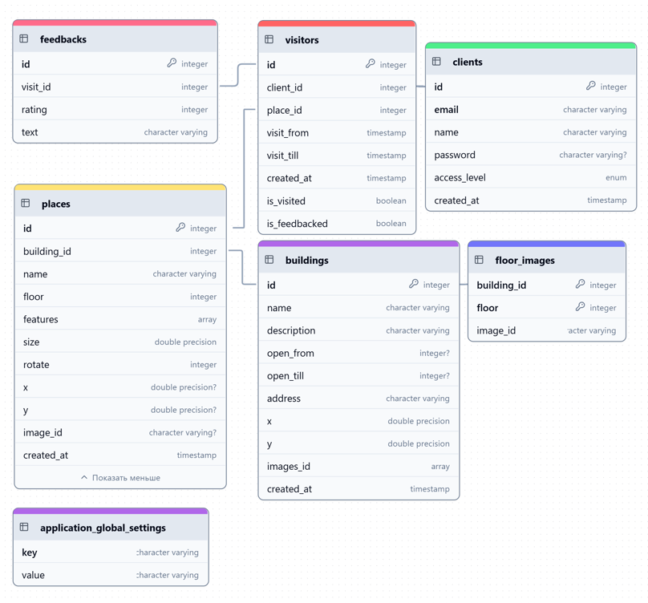
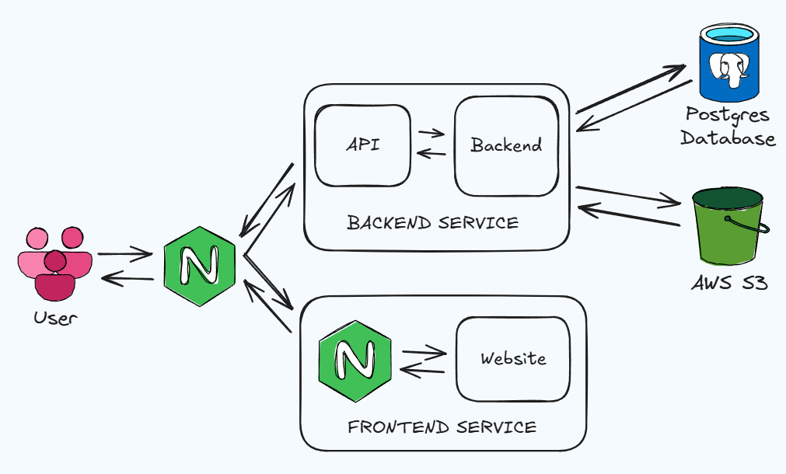

# BookIT

Сервис для бронирования мест в коворкинге, который предоставляет
self-hosted решение для организаций. В .env файле необходимо указать
переменные своего SMTP релея и данные аккаунта владельца.

## Структура проекта

frontend и backend код можно найти в соответствующих папках в **этом** репозитории

## Схема базы данных

## Архитектура взаимодействия сервисов

## Тестирование продукта

**Интеграционное тестирование:** 60% покрытие 
**Unit тестирование:** 91% покрытие

Тесты располагаются в директории `backend/tests` и для их запуска необходимо
выполнение команды `pytest` в папке `backend` с установленным Docker

## CI/CD

Наш продукт оснащён системой CI/CD, выполняя автоматическое тестирование,
сборку и загрузку кода на сервер.

Пример успешного пайплайна CI/CD: https://gitlab.prodcontest.ru/team-39/razoom-team/-/pipelines/16747

Вся конфигурация CI/CD находится в файле `.gitlab-ci.yml`

## Документация

Swagger документация располагается по пути `/api/docs` 
Задеплоенная документация: https://prod-team-39-c4d6ne1t.final.prodcontest.ru/api/docs

