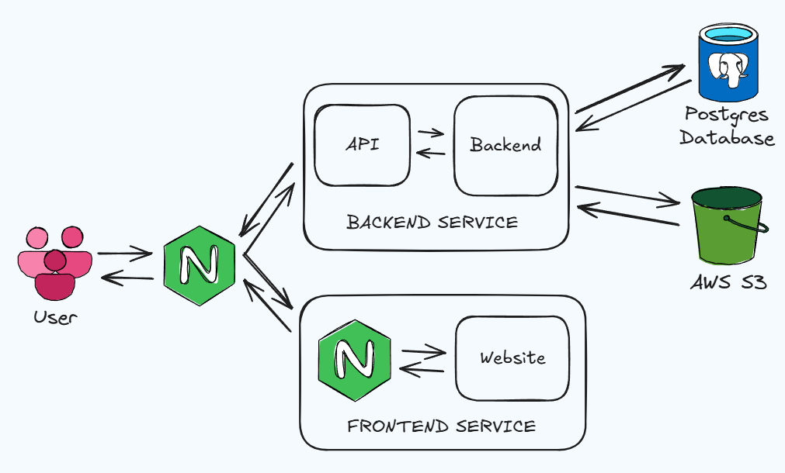

# Описание архитектуры системы BookIT

## Обзор системы

BookIT представляет собой сервис для бронирования мест в коворкинге,
разработанный как self-hosted решение для
организаций. Система позволяет управлять зданиями, помещениями,
пользователями и бронированиями в едином интерфейсе.

## Архитектура системы

Система реализована с использованием современной архитектуры,
где каждый компонент выполняет свою специфическую функцию.
Взаимодействие между сервисами организовано по принципу REST API.

### Диаграмма взаимодействия сервисов

## Ключевые компоненты системы

### Backend (Python FastAPI)

- **Назначение**: Обработка бизнес-логики, управление данными, аутентификация и авторизация
- **Технологии**: Python, FastAPI, AsyncIO, SQLAlchemy
- **Взаимодействие**: Предоставляет REST API для frontend и других внешних систем
- **Особенности**: Асинхронная обработка запросов для повышения производительности

### Frontend

- **Назначение**: Предоставление пользовательского интерфейса
- **Технологии**: JavaScript/TypeScript, React
- **Взаимодействие**: Взаимодействует с backend через REST API

### База данных (PostgreSQL)

- **Назначение**: Хранение всех данных системы
- **Технологии**: PostgreSQL
- **Взаимодействие**: Взаимодействует напрямую с backend через SQLAlchemy

### Object Storage (MinIO)

- **Назначение**: Хранение файлов и изображений
- **Технологии**: MinIO (S3-совместимое хранилище)
- **Взаимодействие**: Взаимодействует с backend для операций с файлами
- **Особенности**: Доступ через совместимый с Amazon S3 API

### Nginx (Web Server)

- **Назначение**: Обратный прокси-сервер, балансировка нагрузки, SSL-терминация
- **Технологии**: Nginx
- **Взаимодействие**: Принимает внешние HTTP-запросы и перенаправляет их соответствующим сервисам

## Потоки данных

1. **Аутентификация пользователя**:
    - Пользователь → Frontend → Backend → База данных → Backend → Frontend

2. **Бронирование места**:
    - Пользователь → Frontend → Backend → Проверка доступности в БД → Запись бронирования → Уведомление пользователя

3. **Управление зданиями и помещениями**:
    - Администратор → Frontend → Backend → База данных → Backend → Frontend
    - При загрузке изображений: Frontend → Backend → MinIO

## Масштабируемость и отказоустойчивость

- Все ключевые сервисы настроены на автоматический перезапуск при сбоях (`restart: unless-stopped`)
- Здоровье сервисов контролируется через механизм healthcheck
- Зависимости между сервисами определены в конфигурации Docker Compose
- Предусмотрена возможность горизонтального масштабирования через реплицирование сервисов
