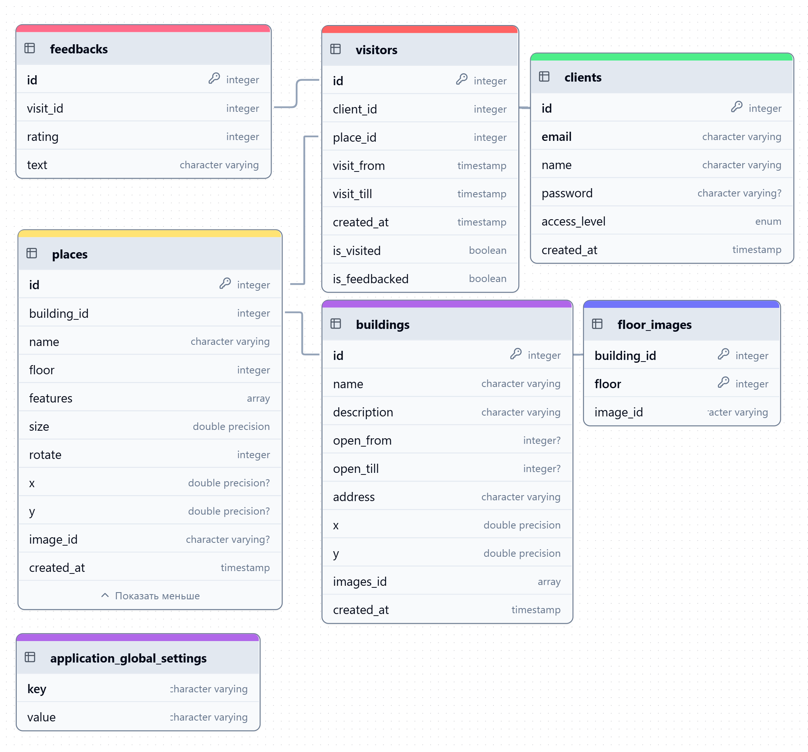

# Описание структуры базы данных BookIT

## Обзор

База данных BookIT спроектирована на основе PostgreSQL и содержит структуры данных,
необходимые для функционирования системы бронирования рабочих мест и помещений в коворкингах.
Схема БД оптимизирована для асинхронной работы с использованием SQLAlchemy.

## ER-диаграмма

## Основные таблицы

### buildings

Таблица содержит информацию о зданиях коворкинга.

| Колонка     | Тип           | Описание                           | Ограничения             |
|-------------|---------------|------------------------------------|-------------------------|
| id          | Integer       | Уникальный идентификатор здания    | PK, AUTO INCREMENT      |
| name        | String        | Название здания                    | NOT NULL                |
| description | String        | Описание здания                    | NOT NULL                |
| open_from   | Integer       | Час открытия                       | NULL                    |
| open_till   | Integer       | Час закрытия                       | NULL                    |
| address     | String        | Физический адрес                   | NOT NULL                |
| x           | Float         | Координата X (долгота)             | NOT NULL                |
| y           | Float         | Координата Y (широта)              | NOT NULL                |
| images_id   | ARRAY(String) | Массив идентификаторов изображений | NOT NULL                |
| created_at  | DateTime      | Дата и время создания записи       | NOT NULL, DEFAULT now() |

### floor_images

Таблица связывает здания с изображениями этажей.

| Колонка     | Тип     | Описание                              | Ограничения            |
|-------------|---------|---------------------------------------|------------------------|
| building_id | Integer | Идентификатор здания                  | PK, FK -> buildings.id |
| floor       | Integer | Номер этажа                           | PK                     |
| image_id    | String  | Идентификатор изображения в хранилище | NOT NULL               |

### places

Таблица содержит информацию о конкретных помещениях или рабочих местах.

| Колонка     | Тип           | Описание                       | Ограничения                  |
|-------------|---------------|--------------------------------|------------------------------|
| id          | Integer       | Уникальный идентификатор места | PK, AUTO INCREMENT           |
| building_id | Integer       | Идентификатор здания           | FK -> buildings.id, NOT NULL |
| name        | String        | Название места                 | NOT NULL                     |
| floor       | Integer       | Номер этажа                    | NOT NULL                     |
| features    | ARRAY(String) | Список характеристик/удобств   | NOT NULL                     |
| size        | Float         | Размер помещения в кв.м.       | NOT NULL                     |
| rotate      | Integer       | Угол поворота на плане         | NOT NULL                     |
| x           | Float         | Координата X на плане этажа    | NULL                         |
| y           | Float         | Координата Y на плане этажа    | NULL                         |
| image_id    | String        | Идентификатор изображения      | NULL                         |
| created_at  | DateTime      | Дата и время создания записи   | NOT NULL, DEFAULT now()      |

### clients

Таблица пользователей системы.

| Колонка      | Тип      | Описание                             | Ограничения             |
|--------------|----------|--------------------------------------|-------------------------|
| id           | Integer  | Уникальный идентификатор клиента     | PK, AUTO INCREMENT      |
| email        | String   | Email пользователя                   | NOT NULL, UNIQUE        |
| name         | String   | Имя пользователя                     | NOT NULL                |
| password     | String   | Хэш пароля                           | NULL                    |
| access_level | Enum     | Уровень доступа (USER, ADMIN, OWNER) | NOT NULL                |
| created_at   | DateTime | Дата и время создания записи         | NOT NULL, DEFAULT now() |

### visitors

Таблица бронирований/посещений.

| Колонка       | Тип      | Описание                           | Ограничения                |
|---------------|----------|------------------------------------|----------------------------|
| id            | Integer  | Уникальный идентификатор посещения | PK, AUTO INCREMENT         |
| client_id     | Integer  | Идентификатор клиента              | FK -> clients.id, NOT NULL |
| place_id      | Integer  | Идентификатор места                | FK -> places.id, NOT NULL  |
| visit_from    | DateTime | Начало бронирования                | NOT NULL                   |
| visit_till    | DateTime | Окончание бронирования             | NOT NULL                   |
| created_at    | DateTime | Дата и время создания записи       | NOT NULL, DEFAULT now()    |
| is_visited    | Boolean  | Флаг состоявшегося посещения       | NOT NULL                   |
| is_feedbacked | Boolean  | Флаг наличия отзыва                | NOT NULL                   |

### feedbacks

Таблица отзывов о посещениях.

| Колонка    | Тип      | Описание                        | Ограничения                 |
|------------|----------|---------------------------------|-----------------------------|
| id         | Integer  | Уникальный идентификатор отзыва | PK, AUTO INCREMENT          |
| visit_id   | Integer  | Идентификатор посещения         | FK -> visitors.id, NOT NULL |
| rating     | Integer  | Оценка (рейтинг)                | NOT NULL                    |
| text       | String   | Текст отзыва                    | NOT NULL                    |
| created_at | DateTime | Дата и время создания отзыва    | NOT NULL, DEFAULT now()     |

### application_global_settings

Таблица глобальных настроек приложения.

| Колонка | Тип    | Описание           | Ограничения |
|---------|--------|--------------------|-------------|
| key     | String | Ключ настройки     | PK          |
| value   | String | Значение настройки | NOT NULL    |

## Связи между таблицами

1. **buildings** ←1:N→ **places**
    - Одно здание может содержать множество мест/помещений
    - Каждое место/помещение принадлежит одному зданию

2. **buildings** ←1:N→ **floor_images**
    - Одно здание может иметь планы для нескольких этажей
    - Каждый план этажа принадлежит конкретному зданию

3. **places** ←1:N→ **visitors**
    - Одно место может быть забронировано многократно
    - Каждое бронирование относится к конкретному месту

4. **clients** ←1:N→ **visitors**
    - Один клиент может иметь множество бронирований
    - Каждое бронирование принадлежит конкретному клиенту

5. **visitors** ←1:1→ **feedbacks**
    - Каждое посещение может иметь один отзыв
    - Каждый отзыв относится к конкретному посещению

## Хранение файлов

Изображения и другие файлы хранятся не в базе данных, а в MinIO (S3-совместимое хранилище). В БД сохраняются только
идентификаторы файлов для эффективного доступа к ним.